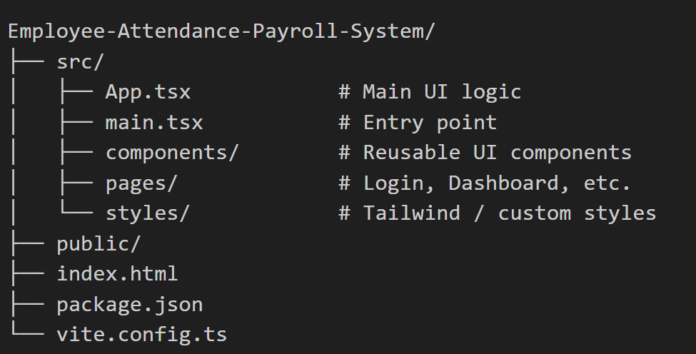
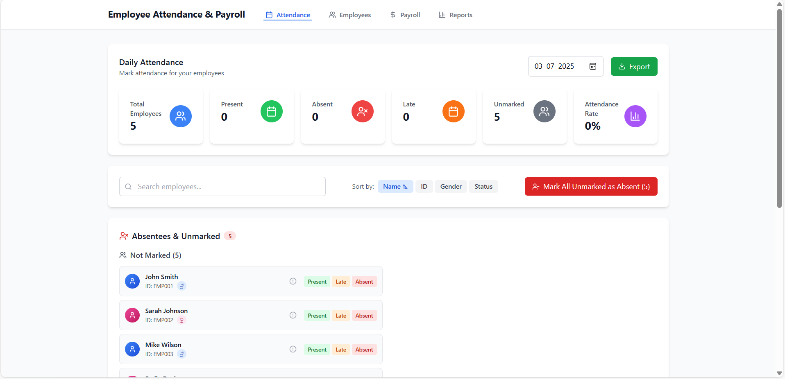
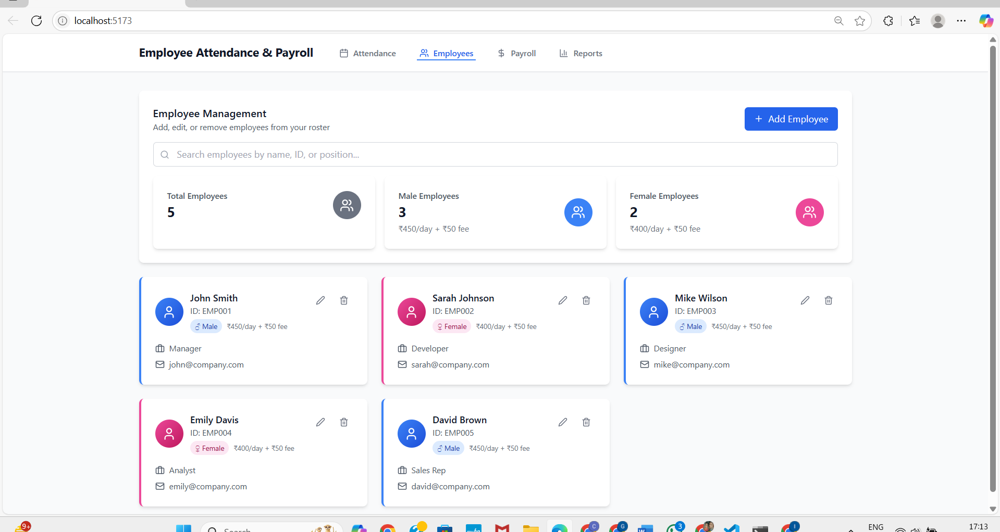
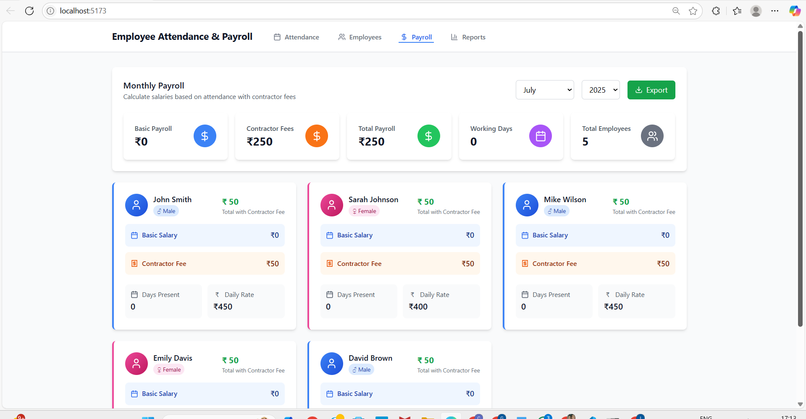
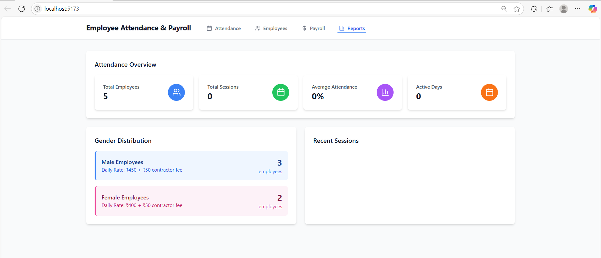
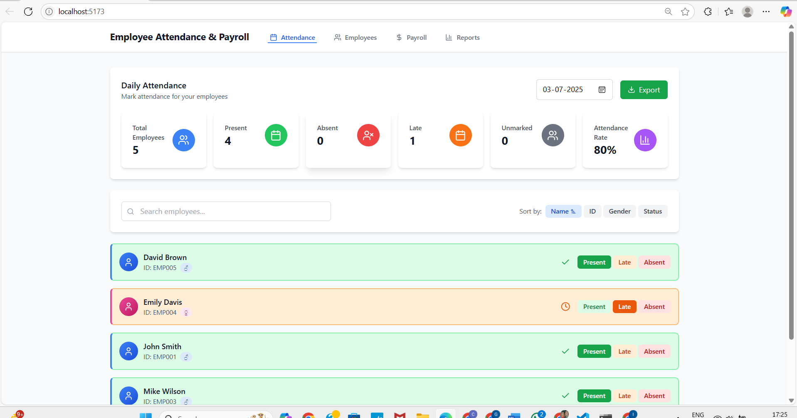

# 👨‍💼 Employee Attendance & Payroll System

A modern web-based Employee Attendance & Payroll System built using *React, **TypeScript, **Vite, and **Tailwind CSS*. This system simplifies employee check-ins, maintains real-time attendance logs, and automates payroll calculations based on working hours.

---

## 🚀 Features

- ✅ *Employee Check-in/Check-out*
- 📅 *Daily, Weekly & Monthly Attendance Logs*
- 🧮 *Automatic Payroll Calculation*
- 📊 *Dashboard for Admin & HR*
- 🔐 *Secure Login for Employees/Admins*
- 🌐 Responsive UI with *Tailwind CSS*

---

## 🛠 Tech Stack

| Technology         | Description                       |
|--------------------|-----------------------------------|
| React + TypeScript | UI and component logic            |
| Vite               | Lightning-fast development build  |
| Tailwind CSS       | Utility-first responsive design   |
| Node.js / Express (optional) | Backend logic (if used)         |
| JSON / API (or Firebase)     | Data persistence & integration |

---

## 📂 Project Structure

---

## 🧪 Running the Project Locally

### 1. Clone the repo

#### 🔗 Shankar's Repository:
```bash
git clone https://github.com/shankar-irla/Employee-Attendance-Payroll-System.git

```
```bash
cd Employee-Attendance-Payroll-System

```
or

#### 🔗 Vivek's Repository:
```bash
git clone https://github.com/vivek068790/Employee-Register-App.git
```
```bash
cd Employee-Register-App
```
### 2. Install dependencies
```bash
npm install

```
### 3. Run in development mode
```bash
npm run dev

```

Visit [http://localhost:5173](http://localhost:5173) in your browser.

---

## 📦 Build for Production

```bash
npm run build

```
Output will be in the dist/ folder.

---

## 🔗 Live Demo

👉 [Click here to view the live app](http://employee-register-app-s7c7-git-main-viveks-projects-a907d5c8.vercel.app)

---

## 🔒 Admin Credentials (Demo)

```bash
Username: admin@example.com
Password: ********

```
---

## 📸 Screenshots

### 📋 Attendance Page


### 👥 Employees Page


### 💰 Payroll Page


### 📊 Reports Page


### 📊 Sample Day OUtput


---
## 📝 License

This project is licensed under the [MIT License](LICENSE).

---

## ✨ Authors
- *Vivek Chittibothula*  
  📧 vivekchittibothula123@gmail.com  
  🔗 [GitHub — vivek068790](https://github.com/vivek068790/Employee-Register-App)

- *Irla Ganga Siva Shankar*  
  📧 238R1A6786@gmail.com  
  🔗 [GitHub — shankar-irla](https://github.com/shankar-irla/Employee-Attendance-Payroll-System)